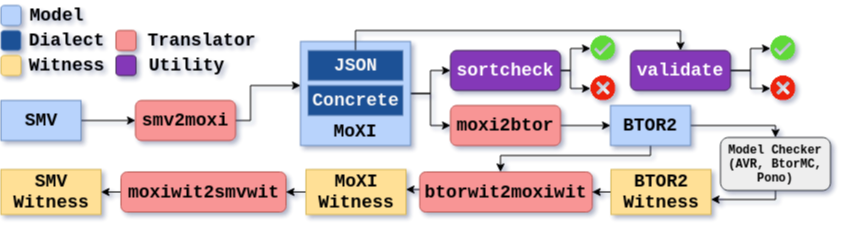

# moxi-mc-flow

Translators from SMV to MoXI to BTOR2 and their witnesses. This repository provides a translation script
(`translate.py`), a model checking script (`modelcheck.py`), a sort checker (`sortcheck.py`), and a JSON validator
(`json-schema/validate.py`) for MoXI files in either a concrete or JSON dialect. For examples of MoXI files, see the
`test/moxi` directory.

## Publications

- Johannsen, C., Nukala, K., Dureja, R., Irfan, A., Shankar, N., Tinelli, C., Vardi, M.Y., Rozier, K.Y.: Symbolic
Model-Checking Intermediate-Language Tool Suite. In: Proceedings of 36th International Conference on Computer Aided
Verification (CAV). LNCS, Springer (July 2024)
- Rozier, K.Y., Dureja, R., Irfan, A., Johannsen, C., Nukala, K., Shankar, N., Tinelli, C., Vardi, M.Y.: Moxi: An
intermediate language for symbolic model checking. In: Proceedings of the 30th International Symposium on Model Checking
Software (SPIN). LNCS, Springer (April 2024)

## Requirements

The following programs/packages are required to run the toolchain and install all the dependencies:

- Python 3.11 (or later)
- jsonschema (Python pip package)
- make
- curl
- cmake
- Flex (for Pono)
- Bison (for Pono)
- GMP (for Pono)
- JRE (for Pono)

The build method has been tested on Ubuntu 20.04 LTS. The dependencies (except Python 3.11 and jsonschema) can be
installed on Ubuntu via:

    sudo apt-get install build-essential curl cmake flex bison libgmp3-dev default-jre

`./contrib/setup-all.sh` installs all supported solvers (`AVR`, `Pono`, `BtorMC`) as well as `btor2tools` for BTOR2
validation and nuXmv for experiments. You can also choose to install specific solvers by running the individual setup
scripts in `contrib/`. For example, to just install `AVR`, run `./contrib/setup-avr.sh`. **To run `translate.py`,
`btor2tools` is required to validate BTOR2 outputs (i.e., to run with the `--validate` option). To run `modelcheck.py`,
at least one solver and `btor2tools` is required.**

## Running the translators

To run the `translate.py` script, feed in a file with a `.smv`, `.moxi`, or `.json` file extension and select language
to translate to (moxi, moxi-json, or btor2). You can ask catbtor or sortcheck.py to validate the output with the
`--validate` flag. Some example invocations (from `/home/moxi-mc-flow`):

    python3 translate.py test/smv/Delay.smv moxi --output Delay.moxi --validate

    python3 translate.py test/smv/Delay.smv btor2 --output Delay.btor2 --validate

    python3 translate.py test/moxi/QF_BV/ThreeBitCounter.moxi btor2 --output ThreeBitCounter.btor2 --validate

You can also cast Int types to bit vectors of specified widths if using a logic with Int sorts, for example:

    python3 translate.py test/moxi/QF_LIA/TrafficLightEnum2.moxi btor2 --output TrafficLightEnum2.btor2 --validate --intwidth 64 

Refer to the usage information for more options:

    python3 translate.py --help

## Running a model checker

To run the `modelcheck.py` script, feed it a `.smv`, `.moxi`, or `.json` file and a backend solver to use for model
checking. The supported backends are `AVR`, `Pono`, and `BtorMC`. See the notes about witness generation.

    python3 modelcheck.py test/smv/Delay.smv btormc --output Delay.smv.witness

    python3 modelcheck.py test/moxi/Delay.moxi btormc --output Delay.moxi.witness

The script runs the BMC algorithm of the selected model checker by default, the `--kind` flag will set the checker to
use it's k-induction algorithm (see notes about `BtorMC` with kind):

    python3 modelcheck.py test/smv/QF_BV/lup.1.prop1-func-interl.btor.smv pono --kind --output lup.1.prop1-func-interl.btor.smv.witness

You can ask the script to copy back all intermediate translation files with the `--copyback` option:

    python3 modelcheck.py test/smv/Delay.smv btormc --output Delay.smv.out --copyback

Refer to the usage information for more options:

    python3 modelcheck.py --help

## Notes

- We do not support the CONSTANT and COMPASSION SMV features. This claim will be removed from the final version.

- No model checker (`AVR`, `Pono`, `BtorMC`) supports the justice keyword in BTOR2, but we do support the translation.
So, a file with a `:fairness` formula will run properly with `translate.py`, but not with `modelcheck.py`.

- Only `BtorMC` is supported for full SMV/MoXI witness translation -- the other model checkers do not support outputting
full traces (i.e., traces that output every variable at every time step) which is necessary for our translation.
`btorsim` could be used to generate a full trace from a compact trace, but does not output correct BTOR2 witnesses (the
headers are incorrect).

- `AVR` does not always output witnesses correctly for arrays -- we skip the file `test/smv/QF_ABV/FIFOs` for `AVR` for
this reason.

- :queries are unsupported in translating to BTOR2 -- we're unaware of a way to require a BTOR2 program to output the
same model for multiple traces across runs.

- The timeout time for benchmarking is only for the model checker call. For example, with a timeout of 10, a call to
modelcheck.py could take 12 seconds if the translation took 3 seconds and the model checking call took 9 seconds.

- Memouts are reported based on the underlying process being killed due to the call to `ulimit -v 8000000` in each
benchmarking script.

- We do not benchmark btormc using k-induction since there is a bug in its implementation
(https://github.com/Boolector/boolector/issues/220)